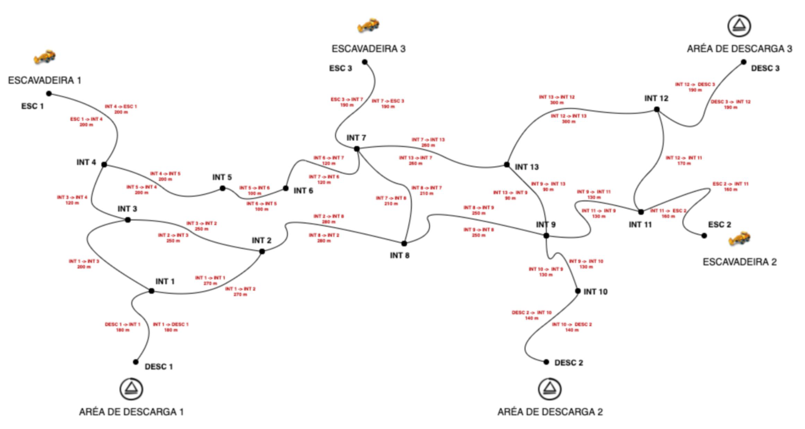

# 🚚[A Melhor Rota] 
* Para solucionar um problema que determina a melhor rota de um caminhão para carga e descarga de minério em uma mina aberta realizada através de uma malha de estradas localizadas dentro da mina, é necessário implementar um serviço que calcule o melhor trajeto que um caminhão precisará seguir para chegar ao seu destino.
---

## 🎯[Objetivos]
 * Implementar uma API que fornece operações necessárias para:
    * Cadastrar/Atualizar localização e status do caminhão.
    * Listar todos os caminhões com suas informações (localização e status).
    * Em relação às informações do caminhão, considerar o seguinte tipo de dados e domínios. 
      * STATUS DO CAMINHÃO (Cheio, Vazio)

    Retornar a melhor rota para o destino final (escavadeira ou área de descarga) dado o  identificador do caminhão. Caso o caminhão esteja CHEIO, a melhor rota deve ser para a  área de descarga mais próxima. Caso o caminhão esteja VAZIO, a melhor rota deve ser para a escavadeira mais próxima.
---

## 🗺️[Mina considerada no desafio]
 
  * Segmentos de estradas e direções permitidas para o tráfego de caminhões
  * Pontos de localização
  * 3 escavadeiras
  * 3 áreas de descarga

    [OBS]: Os caminhões e suas localizações devem ser cadastrados/atualizados dinamicamente via API.
---

---

## 🧬[Requisitos]

Necessário ter instalado os seguintes aplicativos:
* VSCODE
* Python3.8.10
* MySQL
* MySQL Workbench
* Postman (ou qualquer aplicativo para testar REST)
  

